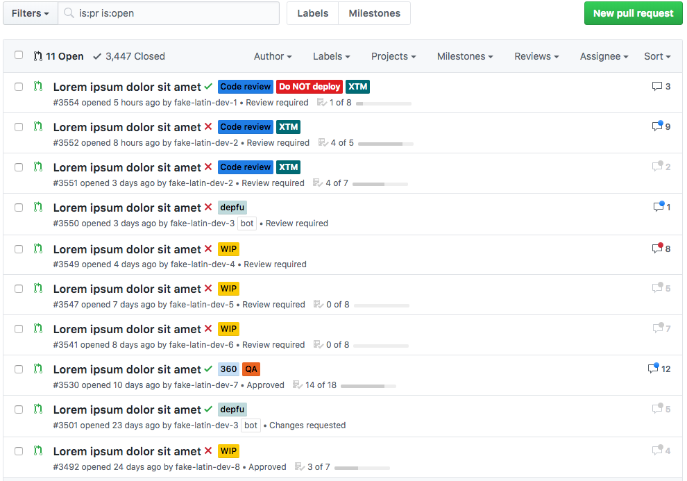
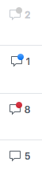

# Github Comment Badges

Github is **awesome**... and yet sometimes you wish for a cooler, more effective, UX.
Maybe you are used to look at long lists of pull requests of your team, periodically hitting the F5 key, to see if someone added a comment to a PR you are following.

Well, good news, you shall no longer have to put up with this.

This userscript will display a **colorful little indicators (also called 'badges')** in each row, in lists such as pull requests and issues.

Doesn't it look better like this ?!

## How does it work ?

The script will remember when you check a pull request (when you go to the details page), and the number of comments present at this moment.  
It will then compare this count to the current count of comments of this PR.

<table>
<tr>
<td></td>
<td><ul>
     <li>No badge: No new comments since last time you checked this PR</li>
     <li>Blue badge: At least one new comment</li>
     <li>Red badge: A lot of new comments (5 or more)</li>
     <li>Faded text with grey badge: You have never checked this PR... do it ! ;)</li>
 </td>
</tr>

</table>

> <i>"Get them all blue"! Gamification of the process of code reviewing by... using colorful [Smarties](https://en.wikipedia.org/wiki/Smarties)</i> 😆

Note the script <strong>periodically fetches the server data and updates the page without a full page refresh </strong>! 🕒  
You will not need to hit F5 again to be up-to-date ️️✌️ 🔥

## Getting Started

### What is a userscript ?

**Userscripts** are little scripts injected in web pages to improve them. See them as add-ons, or extensions, (usually) scoped to pages or sites.  
Adding features/information, changing UI, hiding undesired ads, are typical examples of what they usually do.

Userscripts can easily be converted to browser extensions, or can be run by a userscript manager.

### Prerequisite

The application is has been tested/styled on the latest version of Chrome. (It should also work with Firefox)

In order for your browser to run userscripts, you need to install a userscript manager extension. I recommend **Tampermonkey**  
Install the [Tampermonkey extension](https://chrome.google.com/webstore/detail/tampermonkey/dhdgffkkebhmkfjojejmpbldmpobfkfo)

### Installation

Go to this url: [https://github.com/matthizou/github-comment-badges/raw/master/github-comment-badges.user.js](https://github.com/matthizou/github-comment-badges/raw/master/github-comment-badges.user.js)  
Tampermonkey will pick up the fact that you are displaying a raw userscript and will ask you if you want to install the script.  
Read the code (if you want) and click the **install** button.

### Github Enterprise

At the moment, this script will work with any version of Github enterprise (tested on v2.14)

Simply add a `@match` rule your domain at the beginning of the script, in the metadata block (you will need to edit it Tampermonkey)

i.e, here for Xing I added:  
`// @match https://source.xing.com/*`

💣 &nbsp Those manual modifications of the script will be overwritten every time the script auto-update.   
 Alternatively, you can create a new userscript in Tampermonkey and copy/paste the code there. But this method comes with issues, too: you won't benefit from the code updates, that often are cause to react to  breaking changes in the Github.      
 I plan to fork it in the future the scripts for Github and Github Enterprise, and provide for a solution to the problem above.

## Authors

-   **Matthieu Izoulet**

## Acknowledgments

Thanks to [Xing](https://www.xing.com/) for encouraging the development of this script. Hack weeks are awesome !

## More

I strongly recommend to also check the [Github Show Avatar userscript](https://github.com/matthizou/github-show-avatars). Look how great the two userscripts look, working in tandem.

